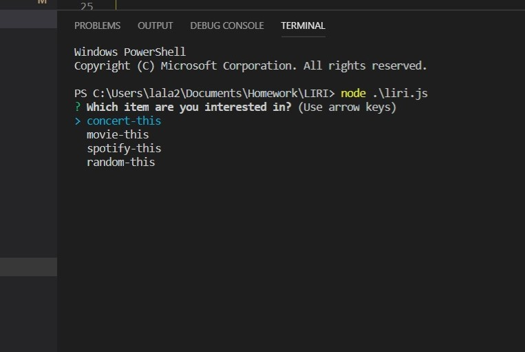
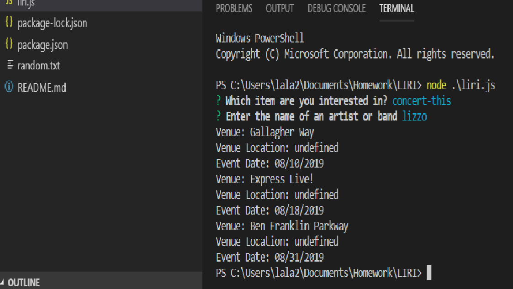
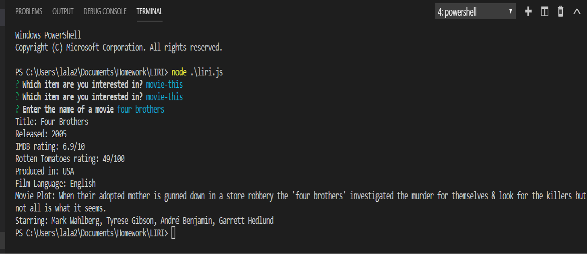
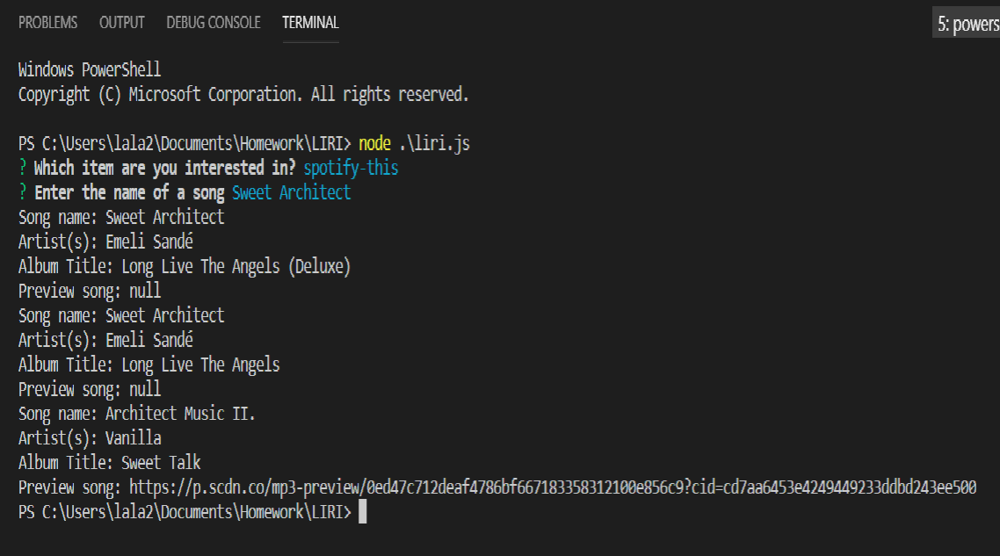

# LIRI Bot

ABOUT THE APP
LIRI is a Language Interpretation and Recognition Interface. LIRI is a command line node app that takes in parameters and gives back data. The user has the option of using four commands (listed below) in conjuntion with specific parameters associated with the commands. 

The Commands are:

* concert-this 
* spotify-this
* movie-this
* random-this

### HOW TO USE LIRI (With Pictures)

Step by Step instructions:

Navigate to the liri.js file.
You will be prompted to choose a command. 

##### Command 1: concert-this

You will be prompted to choose a band or an artist. The system will display a list of the next three event date and locations for that artist.

##### Command 2: movie-this

You will be prompted to enter the name of a movie. The system will display details about the movie such as release date, Rotten Tomatoes rating and movie PLot.

##### Command 3: spotify-this

You will be prompted to enter the name of a song. The system will display details about songs that contain your song's name.  

#### Resources
##### APIs
* [Node-Spotify-API](https://www.npmjs.com/package/node-spotify-api)
* [OMDB API](http://www.omdbapi.com)
* [Bands In Town API](http://www.artists.bandsintown.com/bandsintown-api)

##### NPMs
* [Axios](https://www.npmjs.com/package/axios)
* [Inquirer](https://www.npmjs.com/package/inquirer)
* [Moment NP](https://www.npmjs.com/package/moment)
* [DotEnv NP](https://www.npmjs.com/package/dotenv)
   